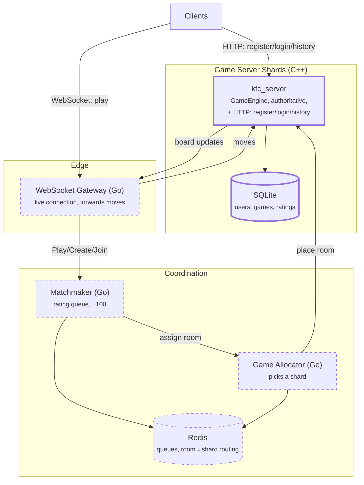

# Microservices Design — splitting `kfc_server` into six components

This document extends [`Server_Design.md`](Server_Design.md), which already
works out *why* a single process has to split (the arithmetic — 5,000,000
concurrent games, ~200 game servers, ~50–100 gateways, Redis for routing,
Postgres sharded by `user_id`) and does not repeat it here. What this document
adds is the finer split into **six named components**, one language per
component, and — critically — an honest line between what actually runs today
and what is still only a design.

The instruction this follows: the client never decides game rules, and neither
does any gateway. The C++ `GameEngine` inside a Game Server Shard is the single
source of truth for what happened in a game, always.

---

## The six components

| # | Component | Responsibility |
|---|---|---|
| 1 | **API Gateway** | Non-realtime HTTP: register/login, match history. Today this is served by the Game Server Shard itself (`kfc_server`'s own HTTP+JSON listener, see row 5) rather than a separate service — see "Built now vs. not yet". |
| 2 | **WebSocket Gateway** | Holds the live connection to each client, decodes our JSON, forwards moves to the right Game Server Shard and board updates back. Owns no game state — today this is `ClientSession` inside `kfc_server`, already free of the board (see `Server_Design.md` §2). |
| 3 | **Matchmaker** | Owns the waiting queues, pairs players within the rating gap. Today this is `RoomManager::join_any` inside `kfc_server`. |
| 4 | **Game Allocator** | Decides which Game Server Shard a newly-matched room runs on. Doesn't exist as a separate decision today — `kfc_server` only ever has one shard, itself. |
| 5 | **Game Server Shards** | The authoritative `GameEngine`/`Match`/`MatchScheduler` stack — real-time simulation, 60 Hz, single source of truth. This is `kfc_server`'s core, unchanged — and, today, also where register/login/history live (row 1). |
| 6 | **Observability** | Logs, metrics, health checks, load tests. Not a service to hand-write — existing tools instrumented against each service. |

## Language per component

| Component | Language | Why |
|---|---|---|
| API Gateway | **C++, folded into the Game Server Shard** | Was Java/Spring Boot against its own PostgreSQL for a short while (Spring Data JPA + `Argon2PasswordEncoder` cover REST+auth+ORM with little hand-rolled plumbing) — reverted deliberately: three HTTP endpoints didn't justify a second language, a second toolchain and, worse, a second account store disconnected from the one the WebSocket login flow already uses. See "Built now vs. not yet". |
| WebSocket Gateway | **Go** *(not yet built)* | Goroutines make thousands of concurrent long-lived connections cheap; this is the same reason Discord and similar real-time platforms lean on Go (or Elixir) for their connection layer. |
| Matchmaker | **Go** *(not yet built)* | A small coordinating service whose real work is reading/writing a Redis-backed rating queue — a lightweight binary that starts fast and scales horizontally is the right shape, and Go is the common choice for exactly this. |
| Game Allocator | **Go** *(not yet built)* | Direct real-world precedent: [Agones](https://agones.dev), Google's own project for "which shard runs this game server" on Kubernetes, is written in Go. |
| Game Server Shards | **C++** | Already built and tested (405+ tests) as `kfc_server`/`kfc_core`. Real-time simulation at 60 Hz with hard performance requirements is the case C++ (or Rust) is actually for — this is not a place to rewrite. |
| Observability | *(tooling, not a service)* | Prometheus for metrics, Grafana for dashboards, structured JSON logs from each service, k6 or Locust for load tests. Every service, regardless of its own language, just needs to expose `/metrics` and `/health`. |

## Target architecture

Extends `Server_Design.md`'s own diagram: a WebSocket Gateway and a Game
Allocator sit between clients/the Matchmaker and the Game Server Shards.
Unlike the original split, register/login/history stays on the Game Server
Shard's own HTTP listener rather than becoming a separate "API Gateway" box —
see below for why.

Solid-bordered nodes (Game Server Shards, SQLite) exist today. Dashed nodes
(WebSocket Gateway, Matchmaker, Game Allocator, Redis) are design only — see
below.

## Built now vs. not yet

**Built, working, verified:**
- **Game Server Shard** — `kfc_server`, doing its own matchmaking, gameplay and WebSocket transport on port 8080, *and* serving `POST /api/auth/register`, `POST /api/auth/login`, `GET /api/history/{username}` on a second port, 8081 (`server/include/kfc/server/http_api.hpp`) — one binary, one SQLite file (`kfc_users.db`), a named volume so it survives a container replace.

**Not yet — documented, not built:**
- **WebSocket Gateway** as its own service. Today `kfc_server` still terminates the WebSocket itself; splitting `ClientSession` out into a standalone Go process needs a real protocol between it and the Game Server Shard (gRPC, or NATS/Redis pub-sub), which is genuinely new plumbing, not a packaging change.
- **Matchmaker** and **Game Allocator** as separate services — `RoomManager::join_any` inside `kfc_server` still does both jobs (pairing *and* placement) implicitly, because there is only one shard.
- **Redis / NATS** — nothing needs cross-service ephemeral state yet, because nothing is cross-service yet.
- **Kubernetes** — Docker Compose only, per the explicit "small version" instruction.

**Why API Gateway isn't its own service anymore:** it briefly was — a Java/
Spring Boot service against its own PostgreSQL, wired into `compose.yaml`
alongside `kfc_server`, and verified working end-to-end (201/200/200 on
register/login/history). It was reverted on purpose: three small endpoints
didn't justify a second language and toolchain, and it left **two separate,
unconnected account stores** — `kfc_server`'s own SQLite and the gateway's
Postgres, with a player having to register in both. Folding the same three
endpoints into `kfc_server`'s existing `UserRepository` (adding `user_exists`,
`record_game`, `history_for` — see `database/README.md`) closes that gap
entirely rather than merely documenting it, at the cost of one more listening
socket in the same process. If a real split is ever warranted again — a
separate team owning auth, or a language boundary that matters for some other
reason — `IUserStore` is still the seam it would happen along.
