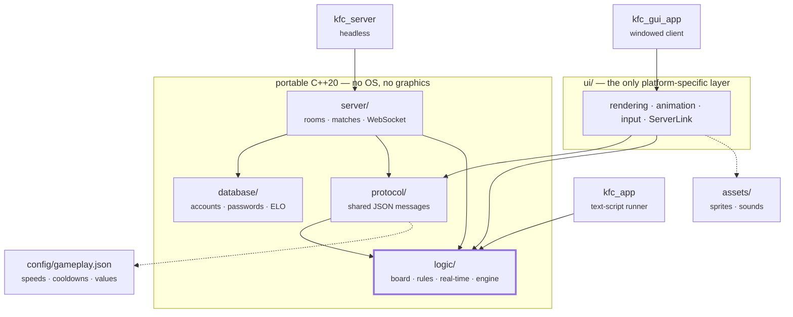

# Kung Fu Chess

A real-time chess variant: **there are no turns.** Either player may move any of
their own pieces at any moment, subject to a per-piece cooldown after each move.
A piece does not teleport — it *travels* to its destination over time, and the
board only changes at the instant it arrives. Capturing a king ends the game.

Built in modern **C++20** with a test-first (TDD) workflow, and split into
layers that each build and test on their own. Play is local (one keyboard) or
networked through a WebSocket server with accounts, ELO matchmaking, named
rooms and spectators.

**336 tests** cover the logic, protocol, database and server.

---

## Contents

| Directory | What lives there | Guide |
|-----------|------------------|-------|
| `logic/` | Board, pieces, movement rules, real-time motion, the game engine. Headless — no graphics, no sockets, no database. | [logic/README.md](logic/README.md) |
| `protocol/` | The JSON messages the client and server exchange, and their (de)serialization. | [protocol/README.md](protocol/README.md) |
| `database/` | Accounts, salted password hashes and ELO ratings, in SQLite. | [database/README.md](database/README.md) |
| `server/` | Rooms, matchmaking, one match per room, and the WebSocket transport. | [server/README.md](server/README.md) |
| `ui/` | OpenCV rendering, sprite animation, mouse input, and the networked client. | [ui/README.md](ui/README.md) |
| `assets/` | Piece sprites, board and background images, sound effects. | [assets/README.md](assets/README.md) |
| `config/` | `gameplay.json` — the speeds, cooldowns and piece values both sides read. | — |

Dependencies point one way only: `ui` and `server` depend on `protocol` and
`logic`; `server` depends on `database`; `logic` depends on nothing. That is why
the whole test suite runs without OpenCV, without a socket and without a
database server.

---

## Building

Requires **CMake ≥ 3.20** and a **C++20** compiler (MSVC 2022+, GCC 10+,
Clang 12+). GoogleTest, nlohmann/json, IXWebSocket and SQLiteCpp are downloaded
automatically by CMake — nothing to install by hand.

**OpenCV is the one dependency you provide yourself.** Everything else is
downloaded for you; OpenCV is not, because building it from source would add
the best part of an hour to every fresh checkout.

- **Windows** — download the prebuilt `OpenCV_451` folder from
  [this Google Drive link](https://drive.google.com/drive/folders/14SeyjbNPvsgyLKM2omcVTlTX0wAQ-_Ox?usp=sharing)
  and place it at `third_party/OpenCV_451/`, so that
  `third_party/OpenCV_451/bin/` contains `opencv_world451.dll` and its `.lib`.
  It is not committed — see `.gitignore`.
- **Linux / macOS** — install it from your package manager
  (`sudo apt install libopencv-dev`, or `brew install opencv`). CMake finds it
  with `find_package`.

**OpenCV is optional.** Without it, the backend, the server and the entire test
suite still configure, build and run — only the GUI client is skipped. CMake
says which it chose:

```
-- OpenCV found -- building the GUI client as well
-- OpenCV not found -- building the backend, server and tests only ...
```

```sh
cmake -S . -B build
cmake --build build --config Debug
```

### Backend and tests only (no OpenCV needed)

```sh
cmake --build build --target kfc_tests
ctest --test-dir build --output-on-failure
```

---

## Running

Run everything from the repository root: the server writes `kfc_server.log` and
`kfc_users.db` to the working directory. (Asset and config paths are baked in at
build time, so those are found from anywhere.)

### Local single-player

```sh
./build/Debug/kfc_gui_app
```

Click a piece, then click its destination. Double-click a piece for its
"jump-in-place" defensive move.

### Networked

Start the server — it listens on `ws://localhost:8080` (pass a port to change
it):

```sh
./build/Debug/kfc_server
```

Then launch a client per player, **each with its own username**. The username and
password are the shell login the spec asks for; the account is registered on
first use and the password must match afterwards.

```sh
./build/Debug/kfc_gui_app --server=ws://localhost:8080 --username=alice --password=pw1
./build/Debug/kfc_gui_app --server=ws://localhost:8080 --username=bob   --password=pw2
```

To play across machines, replace `localhost` with the server's LAN address and
open the port on its firewall.

### The home screen

Each client shows two buttons:

- **PLAY** — matchmaking. Pairs you with a waiting opponent rated within ±100.
  If nobody suitable appears within a minute it says so and returns here.
- **ROOM** — opens a dialog with **Create**, **Join** and **Cancel**.
  - **Create** asks the server for a room; the server generates a short id
    (e.g. `K7QM`) and shows it across the top of your screen. Read it to whoever
    you arranged to play.
  - **Join** takes an id someone gave you. The first to join is Black; **anyone
    who joins after that watches** the game instead of playing, and their header
    reads `WATCHING ROOM`.

### If a player disconnects

The remaining player sees a 20-second countdown. If the dropped player rejoins
the same room **with the same username** they get their own colour and position
back and play resumes. Otherwise the match is forfeited, the opponent wins, and
the dropped player's rating takes a flat penalty. A few seconds after any game
ends the server releases everyone and closes the room.

---

## Testing

One `kfc_tests` target covers every layer:

```sh
ctest --test-dir build --output-on-failure
```

CI builds and runs the whole suite on every push — see
[.github/workflows/ci.yml](.github/workflows/ci.yml).

---

## Portability

`logic/`, `protocol/`, `database/` and `server/` are plain portable C++ — they
contain no OS-specific code at all, so the server runs anywhere.

In `ui/`, exactly two things cannot be written once and compiled everywhere:
native dialogs and audio playback. Both sit behind interfaces
(`IRoomPrompt`, `ISoundPlayer`) with one implementation chosen at build time, so
no `#ifdef` appears anywhere else in the client. Every platform gets a real
implementation of both -- sound included. See [ui/README.md](ui/README.md) for
what each one uses.

CI builds every target on Linux, so the non-Windows implementations are
compiled on every push rather than only when someone happens to try them.

---

## Project structure



**Arrows point from a layer to what it depends on, and never the other way.**
`logic/` sits at the bottom depending on nothing, which is why the whole test
suite runs with no OpenCV, no socket and no database. `ui/` is the only layer
with platform-specific code, and even there it is confined to two interfaces
(`IRoomPrompt`, `ISoundPlayer`) and one screen-metrics file.

Every directory in the table at the top of this file has its own README, and
inside `logic/` each sub-directory has one too — linked from
[logic/README.md](logic/README.md).
