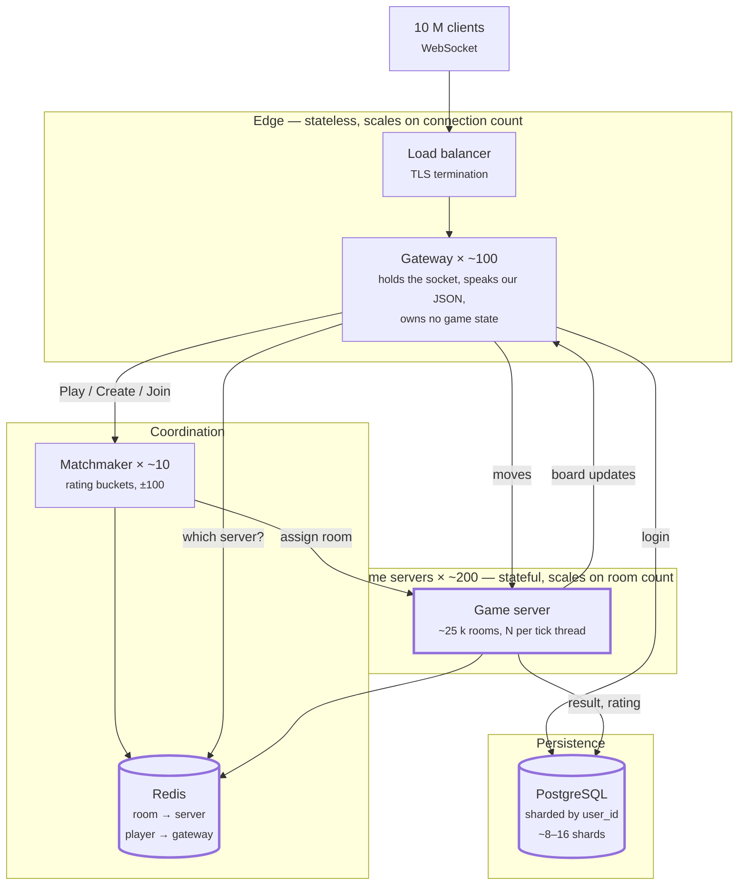

# Server Design — scaling Kung Fu Chess

How the server in this repository would have to change to carry **100 million
registered players, 10 million of them playing at once.**

Today it is one process: [`RoomManager`](server/README.md) holds every room in a
`std::map`, a small pool of `MatchScheduler` worker threads ticks every room's
`Match` in turn (one thread per core, not per room — see that class's own doc
comment for why a `Match` used to own its own thread and no longer does), and
accounts live in a single SQLite file. That is the right shape for one
machine. This document is about what breaks first past that, and what
replaces it.

Every number below is computed, not guessed. The message sizes are measured from
this project's own `encode()` — the arithmetic is at the end.

---

## Aligning with the course's proposed six-component split

The course staff sent a follow-up proposal for a scalable server-side design,
built around six named components and a specific tech stack. This section is
the decision record: which of their six components we already have (under a
different name), which technology recommendations we adopt, and which we
deliberately still defer — so that decision doesn't have to be re-derived
next time this document is read.

| # | Their component | Our name for it | Status |
|---|---|---|---|
| 1 | API Gateway (login, rooms, history — non-realtime) | Folded into the Game Server Shard's own HTTP listener (port 8081) | **Built** — see `Microservices_Design.md` row 1 and "Built now vs. not yet" for why we tried and reverted a standalone one |
| 2 | WebSocket Gateway (live connections, state updates) | Gateway, §2 below | **Built as an in-process role** (`ClientSession`), *not yet* its own container — §2, Microservices_Design.md row 2 |
| 3 | Matchmaker (pairs players) | Matchmaker, §2 below | **Built, but local-only** — `RoomManager::join_any` pairs within one worker; global cross-worker pairing is not yet built (Microservices_Design.md row 3) |
| 4 | Game Allocator (picks which Game Server a room runs on) | Not yet named as its own step | **Not yet built as a decision** — today a room simply runs where its worker created it; Microservices_Design.md row 4 |
| 5 | Game Server Shards (authoritative `GameEngine`) | Game server, §2 below | **Built** — `kfc_server`'s `GameEngine`/`Match`/`MatchScheduler`, unchanged, single source of truth |
| 6 | Observability (logs, metrics, health, load tests) | Observability | **Built** — Prometheus + Grafana in `docker-compose.yml`, `/health` endpoint, k6 load tests (previously tracked under `loadtest/`, now local-only, not git-tracked per explicit instruction) |

Their recommended technologies, against what we run today:

| Recommendation | Our status |
|---|---|
| NATS / Redis PubSub for inter-service messaging | **Not yet.** No service-to-service messaging exists yet because there is only one service (`kfc_server`, replicated as workers). This becomes necessary the moment the WebSocket Gateway and Game Server Shard are split into separate processes talking over the network instead of a function call. |
| Redis for sessions/active rooms/reconnect/matchmaking queue | **Partially built.** `RedisRoomDirectory` already does `room_id → owning worker` routing and survives a worker restart. It does *not* yet hold the matchmaking queue itself (that queue is still per-worker, in-process) or session/reconnect state (that is still `DisconnectWatch`, in-process, per §4 below). |
| PostgreSQL for permanent data (users, games, results, move history) | **Not yet.** Still SQLite, per §1 below. `IUserStore` is the seam a Postgres implementation would slot into without touching call sites. |
| Docker Compose for a small runnable version | **Built.** `docker-compose.yml` runs `kfc_server` (+ Prometheus + Grafana) today; this is the "small working thing" the staff explicitly asked to prefer over an unfinished big one. |
| Kubernetes / K3s for many managed, scaled containers | **Not yet, deliberately.** Per the staff's own instruction ("עדיף משהו קטן שעובד"), we are not building K8s manifests before the services they would orchestrate (Gateway, Matchmaker, Game Allocator as separate processes) actually exist to be orchestrated. Building K8s config for a single-service system would be config with nothing real behind it. |

**The invariant they called out — "the client doesn't decide game rules, and
neither does the Gateway" — already holds.** `ClientSession`/the Gateway role
only decodes JSON and forwards it; every rule check happens inside
`GameEngine`, which is exactly what §2's "Gateway — stateless" description
below says, and it does not change under this proposal.

**What this changes about our plan, concretely:** nothing about the target
architecture in §2–§4 below — their six components map onto our existing
Gateway/Matchmaker/game-server split almost exactly, with "Game Allocator"
naming a decision (*which* shard a newly-matched room lands on) that today is
implicit rather than a separate step. The next concrete build step, when we
pick this up, is still item 2 in "What we would change here, in order":
splitting `kfc_server` into a Gateway process and a Game Server Shard process
talking over the network — because until that split exists, there is no
second service for a Matchmaker or Game Allocator to route *to*, and no need
yet for NATS/Redis pub-sub or Kubernetes.

---

## The numbers everything else follows from

| Quantity | Value | Where it comes from |
|---|---:|---|
| Registered players | 100,000,000 | given |
| Concurrent players | 10,000,000 | given |
| Moves per player | 1 per 2 s | given |
| Game length | 30–90 s (60 s used) | given |
| **Concurrent games** | **5,000,000** | 2 players each |
| **Games starting per second** | **83,333** | 5 M games ÷ 60 s |
| **Moves per second** | **5,000,000** | 10 M ÷ 2 s |
| **Rating writes per second** | **166,667** | 2 per finished game |

The last two rows are the ones that decide the design. Note how large 83,333 is:
**a game is a very short-lived thing**, and the system spends most of its effort
creating and destroying them rather than running them.

---

## 1. Which database? Is SQLite suitable?

**No — but not for the reason it first appears.**

100 M accounts is about **20 GB** (username, salt, hash, rating, overhead). That
fits on a laptop. Size is not the problem.

Three things are:

**SQLite has one writer.** A write takes a lock over the whole database; other
writers wait. We need **166,667 rating writes per second** at the end of games,
plus login writes. SQLite does thousands of small transactions per second, not
hundreds of thousands — the wrong side of the requirement by two orders of
magnitude.

**SQLite is a file on one machine.** Every game server would need the same file.
A network filesystem breaks SQLite's locking, and one machine's disk cannot serve
a thousand servers anyway.

**That machine is a single point of failure.** Lose the disk and all 100 M
accounts go with it. There is no replica to promote.

None of this is a defect. SQLite is explicitly designed for "one file, no
install, one process" — which is exactly what the CTD spec asked for and exactly
what this repo needs today.

### What replaces it

**PostgreSQL, sharded by `user_id`.** One Postgres node handles roughly 10–50 k
simple writes/second, so 166,667 writes/second needs about **8–16 shards** with
headroom. Accounts shard cleanly: a player's row is only ever read or written by
operations about that player, so there are no cross-shard transactions and no
joins between users.

Each shard gets a replica for failover, not for load — a stale replica must never
answer "is this password correct?".

**Redis, separately, for routing** — see §2. It is not a database; nothing in it
survives a restart, and nothing in it needs to.

### One change this forces on our code

`apply_game_result` currently updates both players in **one transaction**
([`user_repository.cpp`](database/README.md)). Two players are two different
shards. That transaction has to become two independent single-row updates, and
the ELO exchange must be computed *before* either is written, so a partial
failure cannot invent or destroy rating points. Being zero-sum, it can be
retried safely.

---

## 2. One server, or many? And who is where?

**Many.** Two separate limits force it, and they are not the same limit.

### Limit one: threads

One `std::thread` per room would be 5 M rooms needing 5 M threads — at even
64 KB of stack each, 320 GB of stack on one machine before any game logic
runs. That limit is already gone inside our code: `MatchScheduler` (see its
own doc comment) drives every room's `Match` from a small pool of worker
threads, one per core, each looping over its own slice of rooms and
advancing them all by the elapsed time — `GameCore::wait(elapsed_ms)` takes
time as a parameter and never reads a clock, which is what lets one thread
serve many rooms. What is left is arithmetic, not architecture: how many
rooms one core's slice can actually carry at 5 M concurrent games, and
everything below this section is about that and about the limits *outside*
one process (many machines, not just many threads on one).

### Limit two: arithmetic

A room tick advances a handful of in-flight motions — call it **5 µs**. At 60 Hz
that is 300 µs of CPU per room per second, so one core carries ~3,300 rooms, and
a 16-core server ~53,000. Leaving half the machine as headroom for spikes and
garbage:

**≈ 25,000 rooms per game server → ≈ 200 game servers.**

Connections are a different budget. Each open WebSocket costs buffers and kernel
state, perhaps 50 KB, so ~200,000 connections per gateway:

**10 M connections → ≈ 50–100 gateways.**

The two numbers are different because they measure different things — which is
precisely why they belong in different containers.

### The roles



**Gateway — stateless.** Terminates the WebSocket, decodes our JSON, and forwards
to the right game server. Holding no game state is what makes it stateless: any
gateway can serve any player, so they scale by adding containers and die without
consequence. This is `ClientSession` almost unchanged — it already talks through
`SendFn`/`CloseFn` and touches no board.

**Matchmaker.** Owns the waiting queues. Must be *global*, not per-server: if
each server matched only its own waiting players, the ±100 rating pool would
fragment into hundreds of small pools and players would wait far longer for a
worse opponent. Sharded **by rating bucket**, never by geography — that keeps
each shard's pool whole.

**Game server — stateful.** Owns the rooms it was assigned and their boards. This
is today's `RoomManager` + `Match`, with the threading change above. Stateful
means a specific player's game lives on a *specific* container, which is what
creates the routing problem.

**Redis.** The directory that solves it: `room_id → game server` and
`player → gateway`. In memory, ~100 bytes per room; 5 M rooms is well under a
gigabyte. Losing it loses in-flight routing, not accounts — which is why it is
kept apart from Postgres.

### "Everyone can play with everyone"

Nothing partitions players by server. A player is assigned to a game server when
their *game* starts, not when they connect, and the matchmaker chooses from one
global pool. Two players who match are simply told the same room, on whichever
server had capacity.

### Joining a room by id

The six-character room id our server already generates
([`generate_room_id`](server/README.md)) becomes a Redis key. Join is: gateway
looks up `room_id` → game server → forwards. One hop, one lookup, no broadcast,
no searching. **The id must stay meaningless** — deriving the server from the id
would pin a room to a server forever and make rebalancing impossible.

---

## 3. How much network traffic? Is that a lot?

Measured from this project's own `encode()`:

| Message | Bytes |
|---|---:|
| `MoveRequest` (client → server) | 86 |
| `MotionStarted` (broadcast) | 285 |
| `BoardUpdate`, one arrival | 297 |
| `BoardUpdate` with a capture | 417 |
| `Welcome`, full 8×8 board | 3,300 |

One move costs 86 B in, and `MotionStarted` + `BoardUpdate` out **to both
seats** — 1,164 B out.

| | |
|---|---:|
| Inbound moves | 0.43 GB/s |
| Outbound moves | 5.82 GB/s |
| `Welcome` at game start (166 k/s) | 0.55 GB/s |
| TCP/IP + WebSocket framing (25 M packets/s) | 1.10 GB/s |
| **Total** | **7.9 GB/s ≈ 63 Gbit/s** |

### Is that a lot?

**No. It is remarkably little for 10 million concurrent users.**

63 Gbit/s is about **2,500 simultaneous 4K video streams**. A single video
service pushes multiple terabits per second; global internet traffic is measured
in hundreds of terabits. This is a rounding error on that scale — and spread over
~100 gateways it is **~600 Mbit/s each**, which any ordinary server NIC carries
without noticing.

Chess is simply a tiny amount of data. A move is two coordinates.

**So bandwidth is not the constraint** — *connection count and CPU are*. It would
be a mistake to design around traffic; the interesting limits are 10 M open
sockets and 25 M packets per second, and packet *rate* is a real cost even when
the bytes are not.

Two observations worth acting on:

- **Our JSON is ~20× larger than it needs to be.** 297 bytes to say "a pawn
  arrived at e4". A binary encoding would be ~16. Worth doing for the packet
  headers and the parse cost — not for the bandwidth, which is already
  comfortable. Readable JSON is also what makes our logs debuggable, so this is a
  real trade, not a free win.
- **`Welcome` is 3,300 bytes and we send 166,667 of them per second.** Game
  *starts* cost about 9% of all traffic. At this rate, "the board as it stands
  now" is worth sending as a compact starting-position marker plus a move list,
  rather than 32 fully-described pieces.

---

## 4. Games last 30–90 seconds. What does that mean?

This is the constraint that shapes the containers most, and it is easy to
under-read. **83,333 games begin and end every second.** A game is not a
long-lived thing to be carefully placed — it is nearly disposable.

**A container per game is impossible.** A container takes ~1 second to start;
the game itself lasts 60. The startup would cost more than the game. Rooms must
be cheap objects *inside* a long-lived server — which is what `Match` already is,
once it stops carrying a thread of its own.

**Deploys become easy, and this is the nicest consequence.** To release a new
version: stop assigning new rooms to a server, and wait. Every game on it ends
within **90 seconds**, by definition. Then it can be killed with nobody
interrupted. Maximum game length *is* maximum drain time — no session migration,
no state transfer, no snapshotting a live board.

**Autoscaling cannot be reactive.** Sixty seconds is too short to notice load,
start a container, and have it help. Scale on *concurrent rooms* with real
headroom, and pre-warm ahead of daily peaks rather than chasing them.

**Failure is cheap, and it should stay cheap.** A game server dying loses its
in-flight games — at most 90 seconds of play for a small fraction of players. It
is not worth replicating live board state to avoid that. Compare that with an
account shard dying: nobody can log in at all. **Different roles deserve
different reliability budgets**, which is a further argument for keeping them in
different containers.

**The 20-second disconnect grace is a third of a game.** Our
[`DisconnectWatch`](server/README.md) holds a seat for 20 s. Redis must therefore
keep the `room → server` mapping for at least the grace period, or a returning
player is routed nowhere and forfeits a game they came back to. The grace period
sets a lower bound on the routing entry's TTL.

---

## What we would change here, in order

1. ~~**One tick thread per core, not per room.**~~ Done — `MatchScheduler`.
2. **Split `kfc_server` into gateway and game server.** Mostly a packaging change:
   `ClientSession` is already free of the socket, and `Match` is already free of
   the network.
3. **`UserRepository` behind an interface**, with a Postgres implementation
   alongside the SQLite one. The interface (`IUserStore`) is built; only the
   Postgres implementation itself is not.
4. ~~**Room directory in Redis** instead of `RoomManager`'s in-process
   `std::map`.~~ Done — `RedisRoomDirectory`, one worker per process, `SET`
   registers a room's owner and a redirect follows a `JoinFailed` for a room
   another worker owns. Global (cross-worker) matchmaking itself — actually
   *pairing* players across workers, not just redirecting a known room — is
   still not built; see Microservices_Design.md's own "not yet" list.
5. **Rating updates as two independent writes**, not one transaction — see §1.
6. **A Game Allocator decision, once step 2 exists.** Today a room simply runs on
   whichever worker created it. Once the Gateway is its own process, placing a
   newly-matched room becomes a real choice (which shard has headroom?) instead
   of "the only shard there is" — this is the course proposal's component 4.
7. **NATS or Redis pub-sub for Gateway ↔ Game Server traffic**, once step 2
   exists — a function call inside one process becomes a network call between
   two, and that needs a real protocol (see Microservices_Design.md's "not
   yet" list).

Steps 2–5 are all made possible by the layering already in the repo: `logic/`
knows nothing about the network, `Match` knows nothing about rooms, and
`ClientSession` knows nothing about sockets. **Scaling out mostly means moving
existing seams onto the network, rather than cutting new ones.**

---

## The arithmetic

```
concurrent games   = 10,000,000 / 2                         = 5,000,000
games per second   = 5,000,000 / 60 s                       =    83,333
moves per second   = 10,000,000 / 2 s                       = 5,000,000
rating writes/s    = 83,333 × 2                             =   166,667

inbound            = 5,000,000 × 86 B                       =  0.43 GB/s
outbound           = 5,000,000 × (285 + 297) B × 2 seats    =  5.82 GB/s
welcomes           = 83,333 × 2 × 3,300 B                   =  0.55 GB/s
packet overhead    = 5,000,000 × 5 packets × 44 B           =  1.10 GB/s
                                                    total   =  7.90 GB/s
                                                            =    63 Gbit/s

rooms per core     = 1 s / (60 ticks × 5 µs)                =     3,333
rooms per server   = 3,333 × 16 cores × 50% headroom        =    26,664
game servers       = 5,000,000 / 26,664                     =      ~190
gateways           = 10,000,000 / 200,000 connections       =       ~50
account storage    = 100,000,000 × ~200 B                   =     20 GB
```

**Assumptions, stated so they can be argued with:** 5 µs per room-tick (this
project's own logic, not measured under load); 16-core game servers; 200,000
WebSocket connections per gateway; a 60-second average game; and every player
being in a game rather than idling in a lobby. The message sizes are the only
figures here that are measured rather than estimated.
